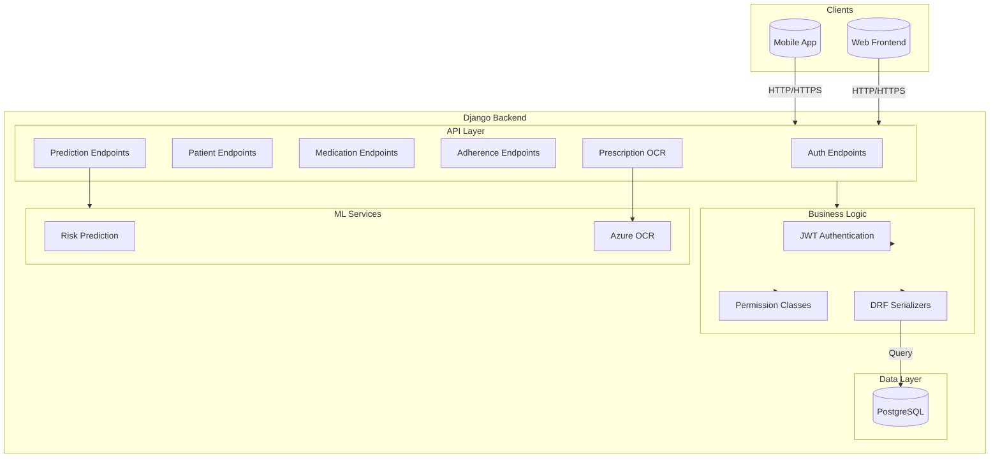
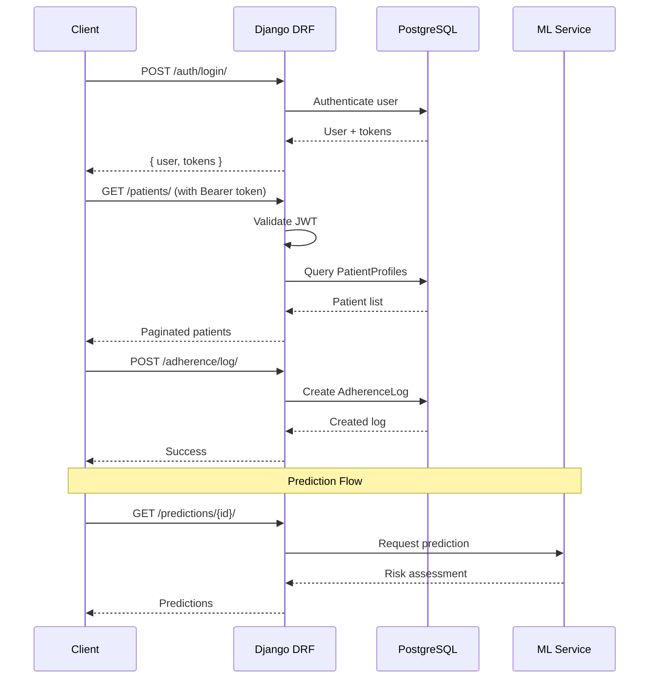

# MedAssist Backend

AI-Powered Medication Adherence System - Django REST API backend.

## Architecture Overview



## Data Model Relationships

```mermaid
erDiagram
    User {
        int id PK
        string email UK
        string name
        string phone
        string role
        bool is_active
        datetime created_at
    }
    
    PatientProfile {
        int id PK
        int user_id FK UK
        int caretaker_id FK
        int age
        string medical_conditions
        datetime created_at
    }
    
    Medication {
        int id PK
        string name
        string dosage
        string frequency
        json timings
        string instructions
        int patient_id FK
        int created_by_id FK
        bool is_active
        datetime created_at
    }
    
    AdherenceLog {
        int id PK
        int medication_id FK
        int patient_id FK
        datetime scheduled_time
        datetime taken_time
        string status
        datetime created_at
    }
    
    Prescription {
        int id PK
        image image
        json extracted_data
        int uploaded_by_id FK
        int patient_id FK
        datetime created_at
    }
    
    Prediction {
        int id PK
        int patient_id FK
        int medication_id FK
        int predicted_delay_minutes
        string risk_level
        text message
        datetime generated_at
    }
    
    User ||--o| PatientProfile : "has"
    User ||--o{ PatientProfile : "manages"
    PatientProfile ||--o{ Medication : "has"
    Medication ||--o{ AdherenceLog : "tracked_by"
    User ||--o{ Prescription : "uploads"
    PatientProfile ||--o{ Prescription : "has"
    PatientProfile ||--o{ Prediction : "has"
```

## API Flow



## Tech Stack

| Category | Technology |
|----------|------------|
| Framework | Django 5 + Django REST Framework |
| Database | PostgreSQL (SQLite for development) |
| Authentication | JWT (djangorestframework-simplejwt) |
| ML | scikit-learn (RandomForest) |
| OCR | Azure Form Recognizer |
| CORS | django-cors-headers |

## Setup

### Prerequisites

- Python 3.10+
- PostgreSQL (optional, SQLite works for development)

### Installation

```bash
# Navigate to backend
cd backend/

# Create virtual environment
python3 -m venv venv
source venv/bin/activate

# Install dependencies
pip install -r requirements.txt

# Configure environment
cp .env.example .env
# Edit .env with your settings

# Create database (if using PostgreSQL)
createdb medassist

# Run migrations
python manage.py migrate

# Create superuser (optional)
python manage.py createsuperuser

# Seed demo data
python manage.py seed_demo_data

# Run development server
python manage.py runserver
```

### Demo Credentials

After running `seed_demo_data`:

| Role | Email | Password |
|------|-------|----------|
| Caretaker | dr.smith@medassist.com | MedAssist2026! |
| Caretaker | dr.patel@medassist.com | MedAssist2026! |
| Patient | john.doe@example.com | MedAssist2026! |
| Patient | mary.johnson@example.com | MedAssist2026! |
| Patient | james.wilson@example.com | MedAssist2026! |
| Patient | sarah.brown@example.com | MedAssist2026! |
| Patient | david.lee@example.com | MedAssist2026! |

## API Endpoints

### Authentication (`/api/auth/`)

| Method | Endpoint | Description | Auth Required |
|--------|----------|-------------|---------------|
| POST | `/auth/register/` | Register new user (caretaker/patient) | No |
| POST | `/auth/login/` | Login with email/password | No |
| POST | `/auth/refresh/` | Refresh access token | No |
| GET | `/auth/me/` | Get current user profile | Yes |
| PUT | `/auth/me/` | Update current user profile | Yes |

### Patients (`/api/patients/`)

| Method | Endpoint | Description | Permission |
|--------|----------|-------------|------------|
| GET | `/patients/` | List caretaker's patients | Caretaker |
| POST | `/patients/` | Create patient profile | Caretaker |
| GET | `/patients/{id}/` | Get patient details | Owner/Caretaker |
| PUT/PATCH | `/patients/{id}/` | Update patient profile | Owner/Caretaker |
| DELETE | `/patients/{id}/` | Delete patient profile | Caretaker |
| GET | `/patients/{id}/detail_with_data/` | Patient with medications & stats | Caretaker |

### Medications (`/api/medications/`)

| Method | Endpoint | Description | Permission |
|--------|----------|-------------|------------|
| GET | `/medications/` | List medications | Owner/Caretaker |
| POST | `/medications/` | Create medication | Caretaker |
| GET | `/medications/{id}/` | Get medication details | Owner/Caretaker |
| PUT/PATCH | `/medications/{id}/` | Update medication | Caretaker |
| DELETE | `/medications/{id}/` | Soft-delete medication | Caretaker |

**Query Parameters:**
- `patient_id`: Filter by patient
- `is_active`: Filter by active status

### Adherence (`/api/adherence/`)

| Method | Endpoint | Description |
|--------|----------|-------------|
| POST | `/adherence/log/` | Log medication intake |
| GET | `/adherence/history/` | Get adherence history (with date filters) |
| GET | `/adherence/stats/` | Get adherence statistics & streaks |

**Query Parameters:**
- `patient_id`: Patient ID (required for caretakers)
- `from`: Start date (YYYY-MM-DD)
- `to`: End date (YYYY-MM-DD)

### Schedule (`/api/schedule/`)

| Method | Endpoint | Description |
|--------|----------|-------------|
| GET | `/schedule/today/` | Get today's medication schedule |

### Prescriptions (`/api/prescriptions/`)

| Method | Endpoint | Description |
|--------|----------|-------------|
| POST | `/prescriptions/scan/` | Upload & OCR scan prescription |
| GET | `/prescriptions/` | List prescriptions |
| GET | `/prescriptions/{id}/` | Get prescription details |
| DELETE | `/prescriptions/{id}/` | Delete prescription |

### Predictions (`/api/predictions/`)

| Method | Endpoint | Description |
|--------|----------|-------------|
| GET | `/predictions/{patient_id}/` | Get ML predictions for patient |
| POST | `/predictions/generate/` | Train model & generate predictions |

## Project Structure

```
backend/
├── manage.py
├── medassist_backend/          # Project config
│   ├── settings.py
│   ├── urls.py
│   └── wsgi.py
├── accounts/                   # Custom User model & auth
│   ├── models.py
│   ├── views.py
│   ├── serializers.py
│   ├── permissions.py
│   └── backends.py
├── medications/                # Patient profiles & medications
│   ├── models.py
│   ├── views.py
│   ├── serializers.py
│   └── urls.py
├── adherence/                  # Adherence logging & stats
│   ├── models.py
│   ├── views.py
│   ├── serializers.py
│   └── urls.py
├── prescriptions/              # OCR prescription scanning
│   ├── models.py
│   ├── views.py
│   ├── services/
│   └── urls.py
├── predictions/                # ML risk prediction
│   ├── models.py
│   ├── views.py
│   ├── services/
│   └── urls.py
├── ml_models/                  # Trained ML model files
├── media/                      # Uploaded files
├── requirements.txt
└── .env.example
```

## Management Commands

```bash
# Seed demo data
python manage.py seed_demo_data
python manage.py seed_demo_data --clear  # Clear first

# Generate synthetic training data for ML
python manage.py generate_training_data
python manage.py generate_training_data --patients 20 --days 60
python manage.py generate_training_data --clear
```

## Known Issues & Improvements

### Security
- No rate limiting on authentication endpoints
- CORS wide open in DEBUG mode
- JWT refresh tokens not blacklisted on logout

### Functionality
- No pagination on all endpoints
- No password reset flow
- No email verification

### Code Quality
- N+1 query potential in some views
- Some hardcoded values (timing buckets)
- No comprehensive test coverage

### Recommended Additions
- Add drf-spectacular for OpenAPI docs
- Implement Celery for async OCR processing
- Add health check endpoint
- Implement Django signals for cleanup
