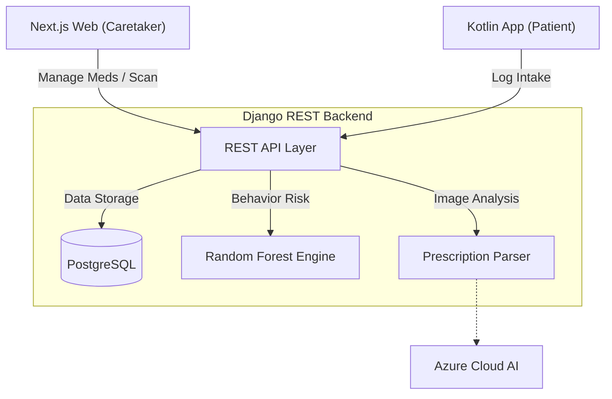

# ⚙️ MedAssist Backend: AI & Data Core

[](https://www.python.org/)
[](https://www.djangoproject.com/)
[](https://www.postgresql.org/)

The backend is the "Brain" of MedAssist. It manages the central database, executes Machine Learning behavioral predictions, and integrates with Cloud AI for OCR prescription scanning.

---

## 🌎 System Overview (The Big Picture)

MedAssist is an ecosystem. Even if you are only working on the Backend, it is critical to understand how the data flows across the entire system.

### Full System Architecture


### The "MedAssist Cycle"
1. **Extraction**: A caretaker scans a prescription. The backend sends it to **Azure**, parses the JSON, and saves `Medication` objects.
2. **Scheduling**: Every day at midnight, the system generates a `TodaySchedule` for each patient.
3. **Engagement**: The patient logs a dose (Taken/Late/Missed) via the **Android App** or **Web**.
4. **Intelligence**: The backend triggers the **Random Forest ML model**, analyzing the last 30 days of logs to predict the patient's risk level for the next week.

---

## 🧠 Intelligence Module Detail

### Machine Learning
The `predictions` module uses `scikit-learn` to train on 16 specific features (Average Delay, Day-of-Week Trends, etc.).
- **ForestClassifier**: Categorizes the patient into High/Medium/Low risk.
- **ForestRegressor**: Predicts exactly how many minutes late the patient might be for their next dose.

### Prescription OCR
Located in `prescriptions/services/ocr_service.py`, this module handles the intelligent extraction of medical data from images.

---

## 🛠 Backend Components
- **`accounts/`**: JWT-based authentication and Role-Based Access Control (RBAC).
- **`medications/`**: Patient profiles and flexible medication definitions.
- **`adherence/`**: The core logic for logs, streaks, and health statistics.

---

## 🚀 Setup & Installation

1. Create a virtual environment:
   ```bash
   python -m venv venv && source venv/bin/activate
   ```
2. Install dependencies:
   ```bash
   pip install -r requirements.txt
   ```
3. Initialize Database:
   ```bash
   python manage.py migrate
   python manage.py seed_demo_data
   ```
4. Start Server:
   ```bash
   python manage.py runserver
   ```

---
<p align="center">Part of the MedAssist Final Year Project Ecosystem</p>
